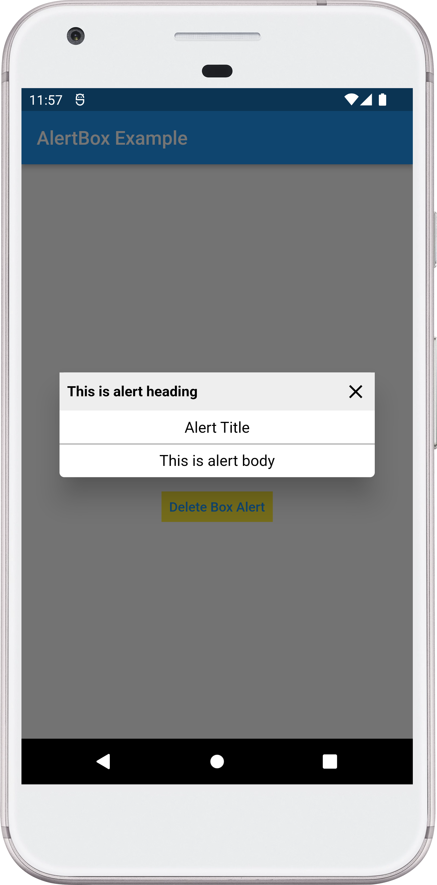
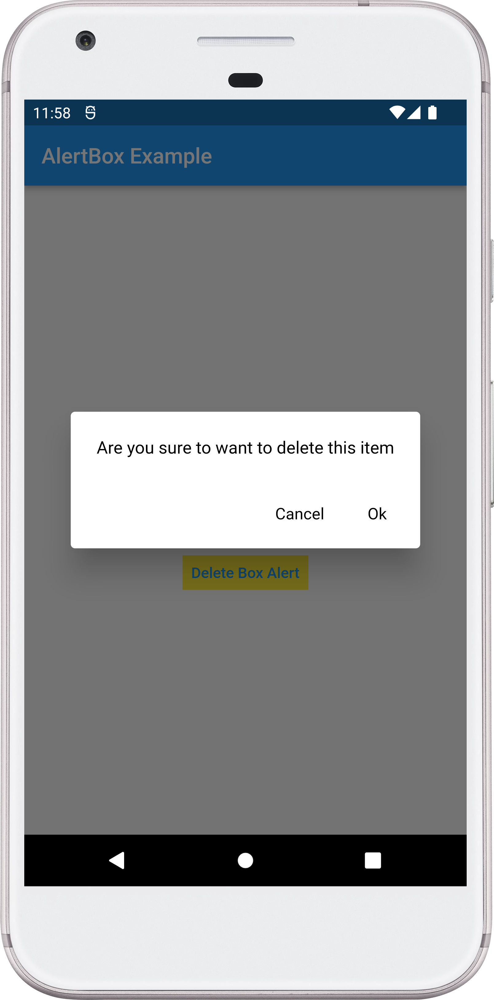
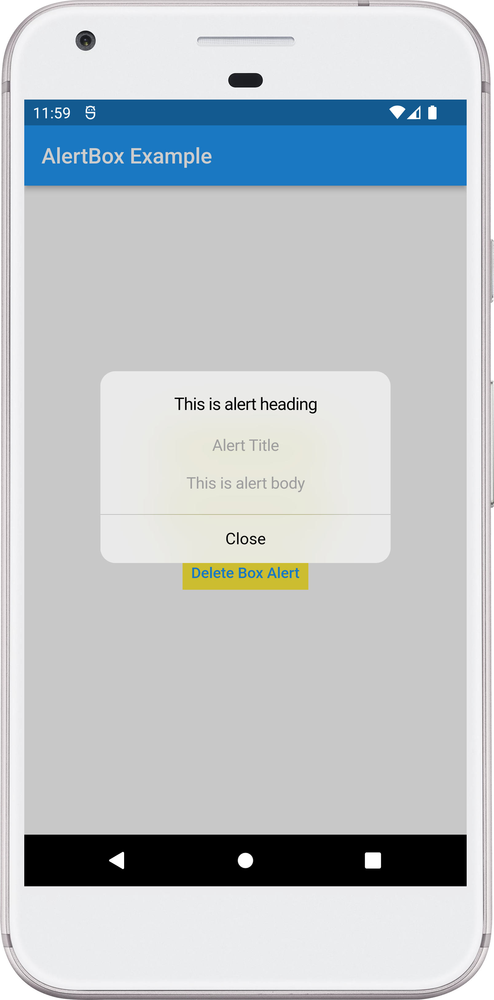
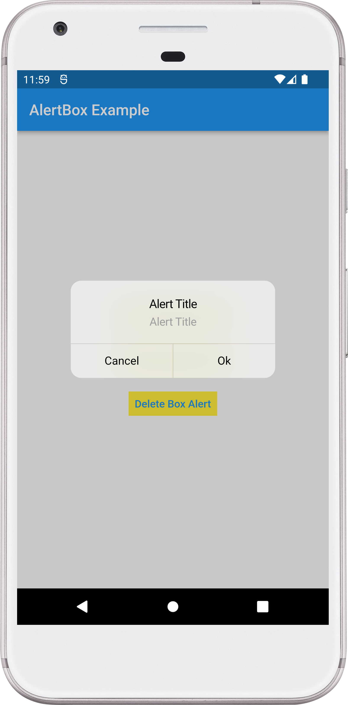
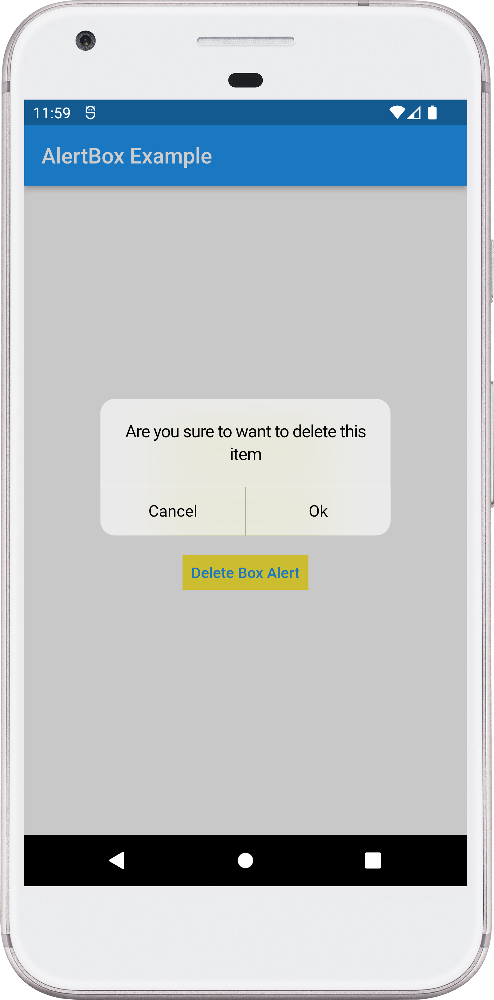

# Flutter Platform AlertBox

## Features

* Information AlertBox
* Confirmation AlertBox
* Delete Item AlertBox

## Supported platforms

* Flutter Android
* Flutter iOS
* Flutter web
* Flutter desktop

## Installation

Add `flutter_platform_alertbox: <latest_version>` to your `pubspec.yaml` dependencies. And import it:

```dart
import 'package:flutter_platform_alertbox/flutter_platform_alertbox.dart';
```

# How to Use


## information AlertBox
```          
 FlutterPlatFormAlertBox().informationDialogBox(
      context: context,
      title: "Alert Title",
      body: "This is alert body",
      heading: "This is alert heading"
  );
```

## Confirmation AlertBox
```          
 FlutterPlatFormAlertBox().confirmationDialogBox(
      context: context,
      title: "Alert Title",
      content: "This is alert body",
      cancelText: "Cancel",
      submitText: "Submit",
      isCancelable: true,
      onSubmit: ()
      {
        debugPrint("submit click");
      }
    );
```

## Delete Item AlertBox
```          
 FlutterPlatFormAlertBox().deleteItemDialogBox(
      context: context,
      title: "Are you sure to want to delete this item",
      cancelText: "Cancel",
      submitText: "Delete",
      isCancelable: true,
      onSubmit: ()
      {
        debugPrint("submit click");
      }
  );
```

## Screenshot

Android                   |  IOS
:-------------------------:|:-------------------------:
  |  







